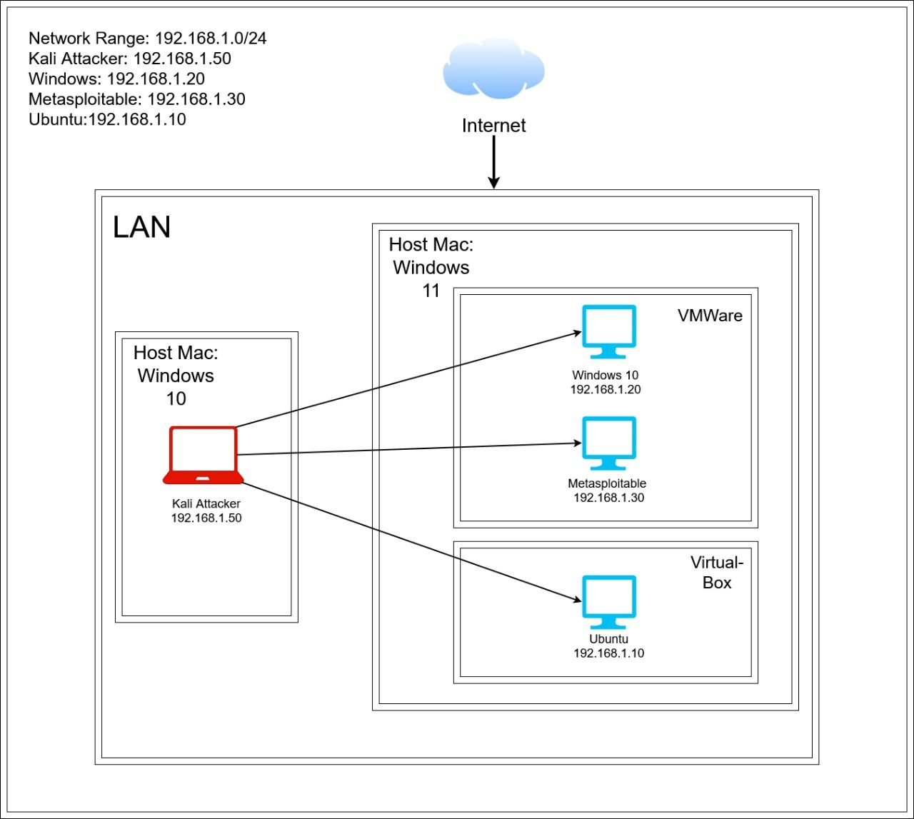

# Snort IDS/IPS Lab Implementation 🔐

This project demonstrates the setup and testing of **Snort as an Intrusion Detection System (IDS) and Intrusion Prevention System (IPS)** in a controlled lab environment using virtual machines.

## 📌 Lab Overview

- **Attacker:** Kali Linux (192.168.1.50)
- **Targets:** Windows 10, Metasploitable, Ubuntu
- **Network Range:** 192.168.1.0/24
- **Detection Engine:** Snort

## 🧠 Objectives

- Detect ICMP ping scans
- Detect brute-force attempts
- Detect Nmap scans (FIN, NULL, XMAS)
- Detect HTTP traffic and basic web attacks
- Understand IDS vs IPS behavior in real-time

## 🏗️ Architecture



## ⚙️ Installation

```bash
sudo apt update && sudo apt upgrade -y
sudo apt install snort
snort -v
